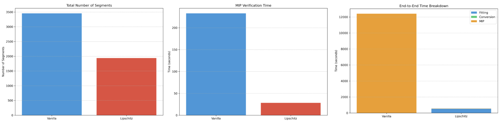

# Optimal Spline Abstractions for Verifying Robustness of KANs

## 📚 Overview
This repo contains code for the paper "Optimal Spline Abstractions for Verifying Robustness of KANs". 
It's the first to look at improving efficiency for verification of Kolmogorov Arnold Networks (KANs). We take advantage of the unique structure of KANs to speed up verification by 10-20x in some cases.

## 💻 Implementation
The KAN is built from scratch in Julia to validate our theoretical work, then scaled to Python for all experiments in the paper.

## 🌟 Key Contributions
We implement dynamic programming algorithms to automatically find the best abstractions for verifying KANs (our algorithm invests more or less computation to estimate different parts of the network). We then compare the speedup between a naive approach and our special allocation by using an MILP solver to verify both linear programming problems.

